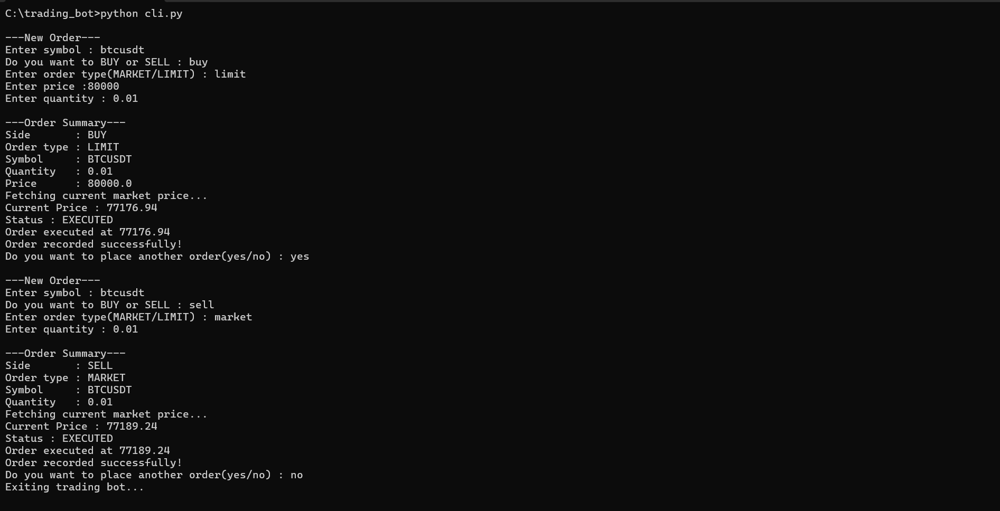

# Binance Trading Bot CLI

## Overview
A Python-based CLI trading bot that simulates placing BUY/SELL orders using real-time market data from Binance.  
It supports both MARKET and LIMIT orders and demonstrates trading logic with structured logging.

## Features
- Place BUY/SELL orders
- Supports MARKET & LIMIT orders
- Real-time price fetching from Binance
- Order execution simulation
- Logging system
- Menu-driven CLI interface
- View order history

## Tech Stack
- Python 3
- python-binance library

## How to Run
1. Clone the repository:
git clone https://github.com/Rosh0005/binance-trading-bot-cli.git

3. Navigate to the folder:
cd binance-trading-bot-cli

4. Install dependencies:
pip install -r requirements.txt

5. Run the application:
python cli.py

## Example Use Case
Simulate placing a LIMIT BUY order and check whether it executes based on the current market price.

## What I Learned
- Working with APIs (Binance)
- CLI application design
- Input validation & error handling
- Implementing trading logic
- Structuring Python projects

## Sample Output 
Example of placing LIMIT and MARKET orders :

## Note
This project simulates trading and does NOT place real orders.
This project simulates order execution due to restricted access to Binance Futures Testnet.
